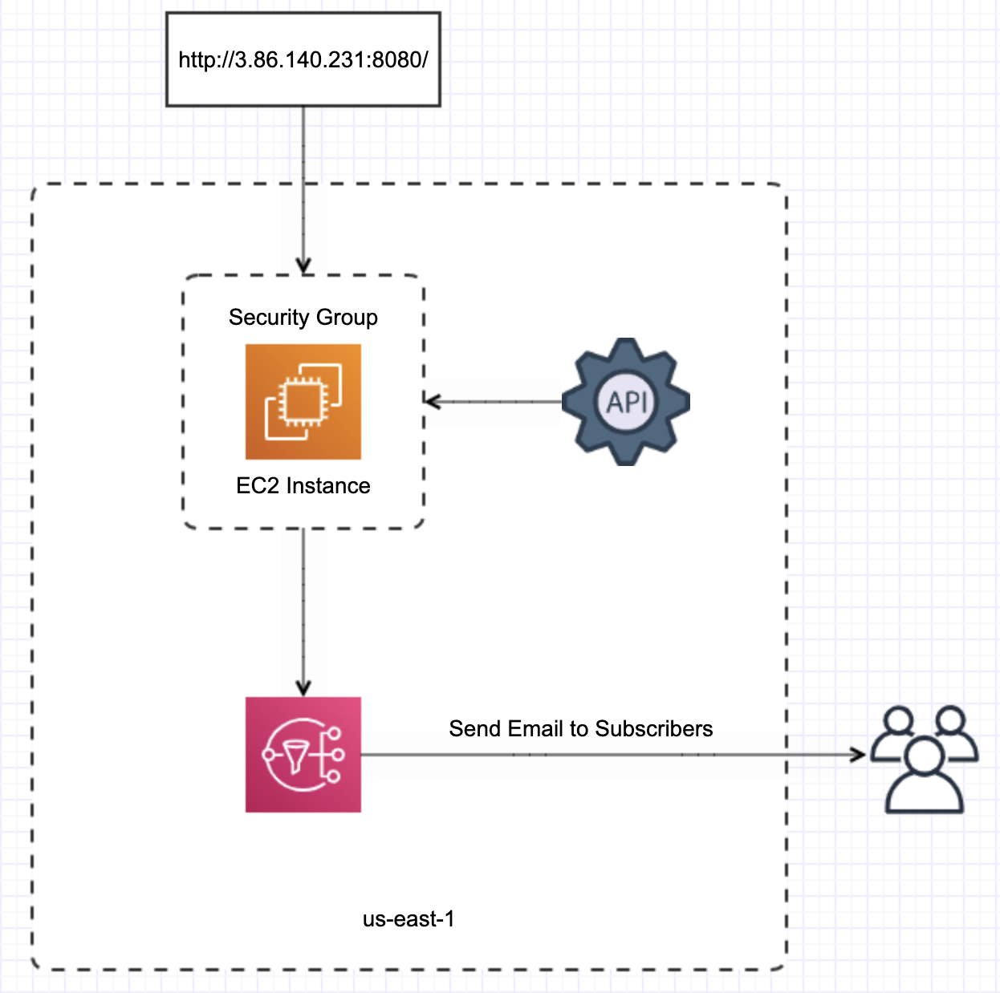

# CS298ProjectAWS

This application retrieves an email and adds it to the Joke of the day topic.
A python script calls joke of the day api and retrieves a random joke. 
A cron command runs a python script to send email with joke to all subscribers of Joke of the day.

